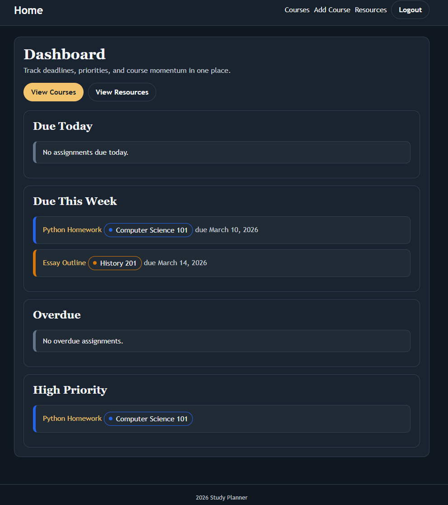
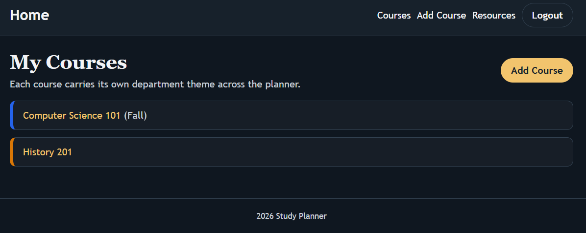
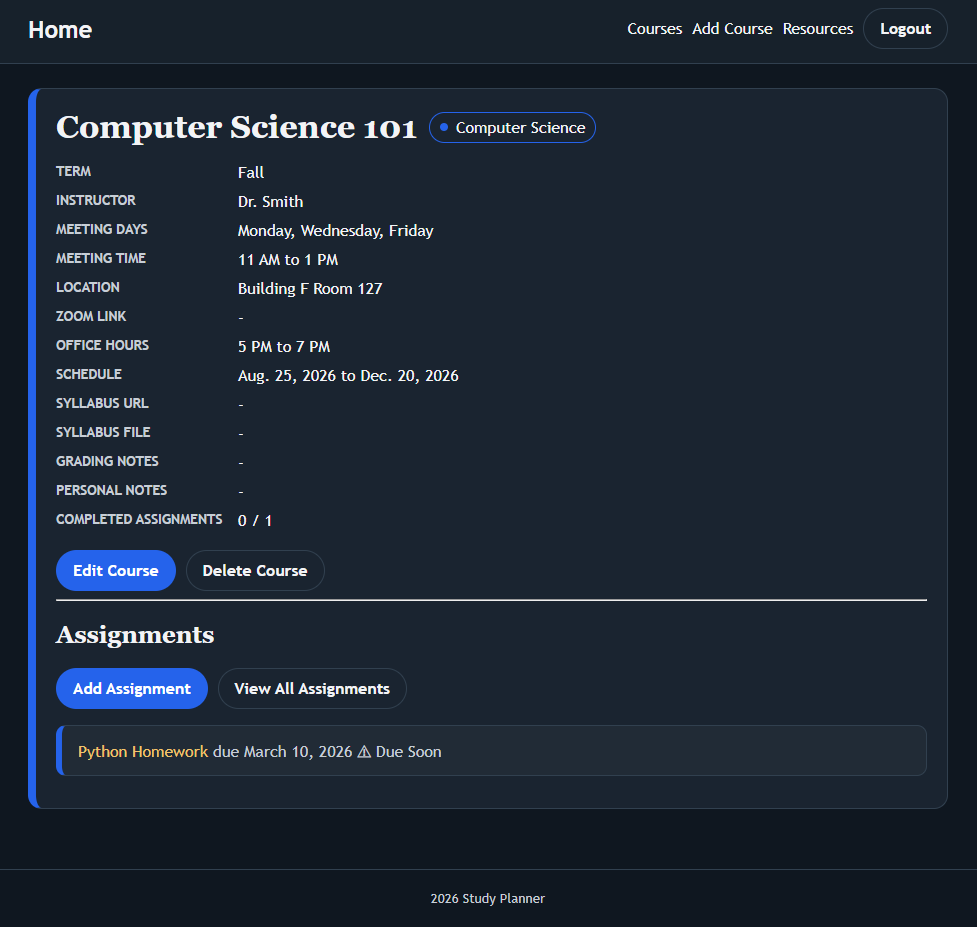
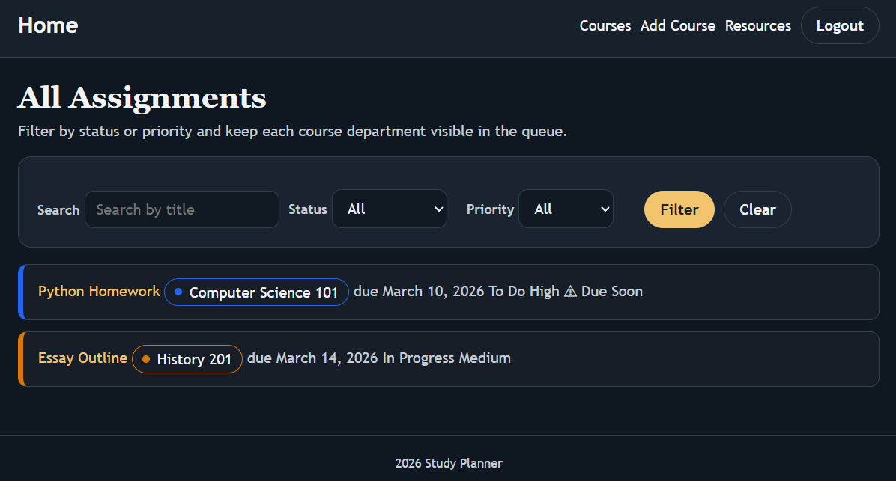
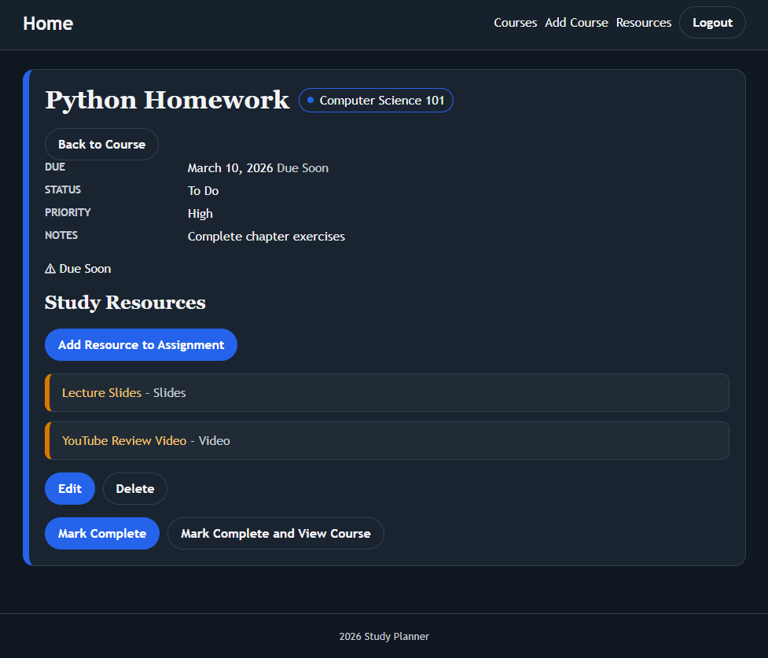

# Study Planner


Study Planner is a Django web application for students who want one place to manage courses, assignments, and supporting study resources. I built it to replace the usual mix of scattered notes, course portals, and deadline lists with a single dashboard that highlights what is due now, what is overdue, and what needs attention next.

## Description

The app gives each user a personal workspace with:

- a dashboard for overdue, due today, due this week, and high-priority assignments
- course records with schedule, instructor, syllabus, grading, and notes
- assignment tracking with status, priority, notes, and linked resources
- a study resource library for videos, articles, slides, textbooks, and practice problems
- authentication so each user only sees their own data

## Getting Started

- Deployed app: [Study Planner](https://study-planner-app-289f997b9ef5.herokuapp.com/)
- Planning materials: [Project planning](https://trello.com/b/Y4OCluBP)
- GitHub repository: [AdamMyers-ai/study-planner](https://github.com/AdamMyers-ai/study-planner)

## Project Structure

```text
.
├── assets/
├── manage.py
├── planner/
├── studyplanner/
├── Procfile
├── Pipfile
└── README.md
```

Active application code lives in `planner/` and `studyplanner/`. The `studyplannerbackup/` directory is an older backup copy and is not part of the main app workflow.

### Local Setup

#### Prerequisites

- Python 3.11
- Pipenv
- PostgreSQL

#### Install dependencies

```bash
pipenv install
```

#### Environment variables

Create a `.env` file in the repo root:

```env
SECRET_KEY=replace-me
```

#### Create the local database

Local development currently expects a PostgreSQL database named `studyplanner`.

```bash
createdb studyplanner
```

If your local PostgreSQL setup uses different credentials or connection settings, update [settings.py](/home/adammyers/code/ga/projects/study-planner/studyplanner/settings.py).

#### Run migrations

```bash
pipenv run python manage.py migrate
```

#### Start the server

```bash
pipenv run python manage.py runserver
```

Open `http://127.0.0.1:8000/`.

#### Seed demo data

```bash
pipenv run python manage.py seed_data
```

Demo credentials:

- Username: `demo_user`
- Password: `password123`

#### Run tests

Because the repo includes `studyplannerbackup/` as a backup copy, scope test discovery to the active app:

```bash
pipenv run python manage.py test planner --settings=studyplanner.test_settings
```

## Screenshots










## Technologies Used

- Python
- Django
- PostgreSQL
- SQLite for tests
- Gunicorn
- WhiteNoise
- `python-dotenv`
- `dj-database-url`
- HTML
- CSS

## Attributions

- Logo concept created with assistance from ChatGPT.
- [Django documentation](https://docs.djangoproject.com/en/5.2/)
- [WhiteNoise documentation](https://whitenoise.readthedocs.io/)
- [PostgreSQL documentation](https://www.postgresql.org/docs/)

## Next Steps

- Add calendar views and reminders for upcoming assignments
- Support file uploads for study resources in addition to external links
- Add course-level analytics for completion rates and workload trends
- Improve assignment filtering with date ranges and department filters
- Add dashboard charts for progress across the current term

## Deployment Notes

- The app includes a [Procfile](/home/adammyers/code/ga/projects/study-planner/Procfile) for Gunicorn.
- When `ON_HEROKU` is set, the app reads `DATABASE_URL` and requires SSL for the database connection.
- Static files are served through WhiteNoise.
